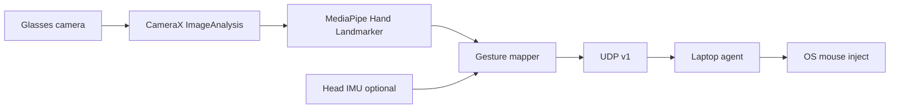
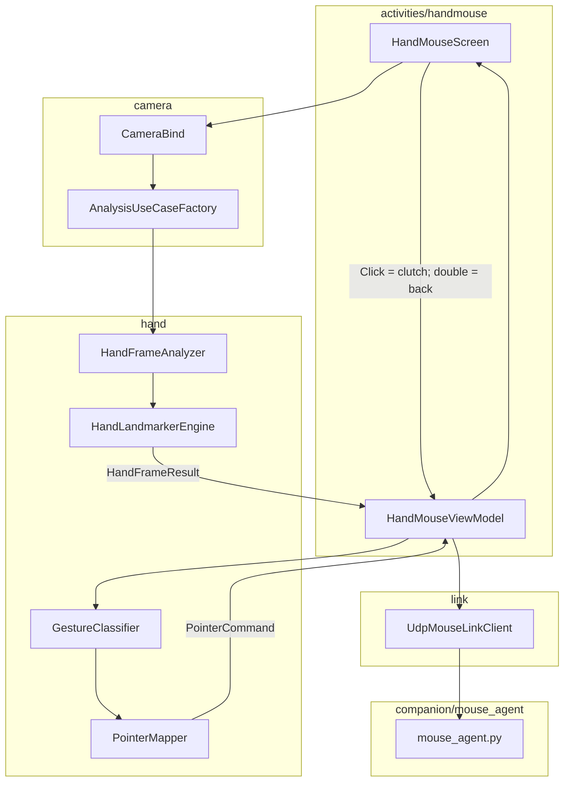

# Rokid Glasses: Hand Pose → Laptop Mouse Control

Plan for adding MediaPipe-based hand pose estimation on Rokid AI glasses to control a mouse on a laptop.

## Verdict

**Plausible as a prototype**, not as a daily “invisible air mouse” replacement for a real trackpad. MediaPipe Hand Landmarker on the glasses camera + a laptop receiver that injects mouse events is a standard architecture.

This sample (`GlassesBareDevSample`) already has CameraX and IMU; it does **not** yet have frame analysis, ML, or any link to a PC.

The hard parts are FOV/ergonomics, on-device FPS/latency, and a stable gesture→mouse mapping — not whether MediaPipe “works.”

## Plan review (2026-07-26)

### Assessment

The architecture is viable for a prototype, and the staged approach is correct. The plan should proceed only after a short hardware feasibility test because the exact Rokid model, camera field of view, SoC/delegate support, thermal limits, and camera orientation are not documented in this repository.

The target for the first usable version is deliberately narrow:

- one hand;
- relative cursor movement;
- thumb–index pinch for left click;
- TouchPad clutch to enable/disable output;
- same-LAN connection to a Windows companion;
- no scrolling, right click, BLE HID, or IMU fusion until the basic loop is stable.

### Main concerns

1. **Unknown hardware capability is the largest risk.** Raw CameraX FPS does not prove MediaPipe performance. The decisive gate is sustained end-to-end landmark inference on the actual glasses, including temperature and dropped-frame behavior.
2. **Camera geometry is not specified.** Sensor rotation, lens orientation, crop, and whether the image must be mirrored must be measured. Incorrect transforms will invert or rotate pointer motion.
3. **The camera moves with the wearer’s head.** A stationary hand can move in image coordinates when the user turns their head. Relative mapping may need a larger deadzone or IMU compensation; this is an experiment, not an assumed stage-5 enhancement.
4. **Gesture semantics need hysteresis.** A single pinch threshold will create repeated or accidental clicks. Use scale-normalized thresholds, enter/exit hysteresis, minimum hold time, and cooldown.
5. **UDP needs safety semantics.** Motion can tolerate loss; button state cannot remain ambiguous. Add sequence numbers, repeated current-button state, heartbeat timeout, duplicate rejection, and a receiver-side emergency stop. Default to output disabled.
6. **Configuration UX is unresolved.** The glasses have no normal keyboard. For the prototype, inject laptop IP/port through an ADB command or build config; later add discovery or a minimal settings/pairing flow.
7. **The original module sketch is somewhat over-segmented for stage 1.** Create interfaces/files only when a stage uses them. Avoid empty scaffolding and avoid placing feature thresholds or host addresses in global `CONSTANT.kt`.
8. **Testing must include latency, thermal behavior, and false clicks—not FPS alone.** Unit-test pure gesture/mapping/packet logic and validate the camera/MediaPipe path on hardware.

### Decisions required before implementation

- Record the exact Rokid model, Android build, CPU/ABI, available memory, and camera characteristics.
- Confirm whether the MediaPipe Tasks Android artifact and hand-landmarker model support the device ABI.
- Decide the stage-4 companion language. This plan assumes **Python for prototyping**; use native Windows `SendInput` later only if packaging or latency requires it.
- Confirm both glasses and laptop can join the same LAN and exchange UDP packets.

---

## What you already have vs what you need

| Need | This sample |
|------|-------------|
| Camera frames for ML | Photo/video only — build `ImageAnalysis` and bind it through existing `rememberCameraBound` |
| Hand landmarks | None — add **MediaPipe Tasks Vision (Hands)** |
| Send control to laptop | None — add same-LAN UDP for the prototype |
| Head pose (optional fusion) | Already in `sensor/` |
| Glasses keys as modifiers | Already via `BareGlassesInputDispatcher` |

### Sample capability notes

- Camera: CameraX bind helper binds business use cases only (no Preview today); `DEFAULT_BACK_CAMERA`.
- Display: fixed **480×640** px, safe area y=80–560, pitch-black background.
- No `INTERNET` permission yet; no Bluetooth/USB/network code.
- IMU: gyro + accel head orientation tracker available for optional fusion.

---

## Recommended architecture



1. **Glasses app**  
   Camera → MediaPipe → landmarks / gestures → compact packets over LAN.

2. **Laptop agent** (Python first; native Windows later if justified)  
   Receive packets → validate/session-check → relative cursor move and left-button state → OS mouse injection.

Keep inference on the glasses only if the complete landmark pipeline sustains acceptable latency and temperature. A starting target is ≥15 analyzed frames/s, p95 inference ≤80 ms, and no sustained thermal degradation during a 10-minute run. If it fails, first reduce input size/model complexity; only then evaluate laptop-side inference. Streaming frames is a separate architecture with privacy, bandwidth, encoding-latency, and security costs—not a drop-in fallback.

---

## MediaPipe on glasses (general approach)

1. Add CameraX `ImageAnalysis` (start at 640×480, `STRATEGY_KEEP_ONLY_LATEST`).
2. Start with **MediaPipe Hand Landmarker VIDEO mode** (`detectForVideo`) on the dedicated analysis executor, one hand, and strictly increasing monotonic timestamps. Its synchronous ownership is easier to make correct with `ImageProxy`. Consider LIVE_STREAM only after the baseline works and input-buffer lifetime is explicit.
3. Handle sensor rotation and crop explicitly; verify x/y direction on hardware before mapping a cursor.
4. Ensure every `ImageProxy` is closed in a `finally` block after the detector has consumed it. If a later async pipeline wraps the camera image without copying, keep the underlying image valid until MediaPipe has finished.
5. Run analysis on a dedicated executor and release the executor, detector, and CameraX use case with the scene lifecycle.
6. Start with CPU inference. Test a GPU delegate only after confirming that it is supported and actually improves sustained performance on the glasses.
7. Convert landmark space → control signals, e.g.:
   - **Move**: index fingertip (or palm center) Δx/Δy with smoothing + deadzone
   - **Left click**: thumb–index pinch
   - **Idle / lock**: fist or hand out of frame
8. Normalize pinch distance by palm/hand size. Use separate pinch-on/pinch-off thresholds, a minimum hold, and cooldown.
9. Track camera arrival FPS, analyzed FPS, dropped frames, inference p50/p95, and end-to-end command latency separately.
10. Freeze output immediately when the hand is lost or the clutch is disabled.

UI on the glasses should stay sparse (480×640 safe area): status like `TRACKING` / `PINCH` / `LINKED`, not a full skeleton overlay unless debugging.

---

## Laptop mouse control

Typical stack:

- **Transport**: UDP on the same Wi‑Fi for the first prototype.
- **Packet**: version, session ID, sequence, timestamp, flags, relative `dx/dy`, and current button state. Repeat current state in heartbeats so a lost transition cannot leave the mouse stuck.
- **Inject**: Windows `SendInput` / Python `pynput` / AutoHotkey-style wrapper.
- **Mapping modes**:
  - **Absolute**: hand position ↔ screen position (needs calibration pose).
  - **Relative** (usually better): fingertip velocity → mouse delta (like a trackpad).

**Safety and security:**

- receiver starts disarmed and requires an explicit local enable action;
- accept only the configured glasses IP/session token;
- release all buttons and stop movement after a short heartbeat timeout;
- reject stale, duplicate, malformed, or unsupported-version packets;
- provide an immediate keyboard emergency-stop shortcut;
- bind to a private LAN interface and never expose the port to the public internet.

---

## Plausibility caveats

1. **Camera FOV** — Back/world camera looks forward. Hands must be held in the camera cone (roughly in front of the face). Desk-level typing posture often fails. Plan for a deliberate “control zone” in mid-air.
2. **Latency** — A planning estimate is ~80–200 ms for inference + Wi‑Fi + OS injection, but it is not yet measured on this hardware. It may suit menus/browsing and is unlikely to suit precise drawing or FPS aiming.
3. **Compute / heat** — Hand Landmarker at 30 FPS may throttle on glasses. Start at lower resolution/FPS and measure sustained behavior.
4. **2.5D, not true 3D mouse** — MediaPipe gives image-plane landmarks; “depth click” is usually **pinch**, not Z-push.
5. **Lighting & occlusion** — Outdoor glare, dark rooms, and hand leaving frame will break tracking; need hysteresis and “cursor freeze when lost.”
6. **No HID path in this sample** — Custom app↔agent is the realistic path; pretending to be a Bluetooth mouse is much harder.

**Overall:** good hackathon / research prototype for “pinch to click, wave to move cursor.” Weak as a daily primary pointing device unless you invest heavily in calibration, smoothing, and UX.

---

## Development stages and exit gates

An emulator or phone may validate Compose UI and pure Kotlin logic, but it cannot validate Rokid camera geometry, MediaPipe performance, glasses input, or thermal behavior.

### Stage 0 — Hardware reconnaissance (no feature code)

Collect and save:

```powershell
adb shell getprop ro.product.model
adb shell getprop ro.build.version.release
adb shell getprop ro.product.cpu.abilist
adb shell dumpsys media.camera
adb shell dumpsys meminfo com.rokid.glassesbaredevsample
```

Manually verify that the hand is visible in the camera’s normal forward field at a tolerable pose. Capture sample photos in bright indoor, dim indoor, and backlit conditions.

**Exit gate:** camera sees the intended control zone; device ABI and camera characteristics are known.

### Stage 1 — Camera analysis benchmark (no MediaPipe)

- Add a `HAND_MOUSE` scene and bind one `ImageAnalysis` use case through existing `rememberCameraBound`.
- Use keep-only-latest backpressure and a dedicated executor.
- Log frame dimensions, format, rotation, arrival FPS, analyzed FPS, and dropped-frame estimate.
- Verify every frame closes and camera unbinds on navigation away.

**Exit gate:** 10-minute run without stalls/leaks; stable frame delivery; orientation and x/y directions documented. This gate validates CameraX integration only.

### Stage 2 — MediaPipe landmark benchmark

- Add the pinned MediaPipe Tasks Vision dependency and a pinned, licensed `hand_landmarker.task` asset.
- Configure one hand and synchronous VIDEO operation first; use monotonic millisecond timestamps.
- Log detector initialization errors and performance metrics without logging images.
- Add a debug-only landmark status/overlay if needed; do not require CameraX Preview.

**Exit gate:** on real glasses, ≥15 analyzed FPS as an initial target, p95 inference ≤80 ms, no material degradation during a 10-minute run, and acceptable detection across expected lighting. If not met, test lower resolution/confidence and delegates before considering remote inference.

### Stage 3 — Local gesture and pointer behavior

- Implement only hand-present, relative move, and thumb–index left click.
- Use palm center or a stable landmark aggregate for movement; compare against index fingertip experimentally.
- Add smoothing, acceleration curve, deadzone, pinch hysteresis, hold time, cooldown, and hand-loss reset.
- TouchPad click toggles clutch; output starts disabled. Double-click returns.
- Keep commands local and show counters/status on the HUD; do not add networking yet.

**Exit gate:** scripted 100-pinch test has zero stuck buttons and an agreed false-positive target (initially <2%); loss of hand freezes within 150 ms; movement feels controllable while the head is still and while it moves.

### Stage 4 — LAN companion and mouse injection

- Add `INTERNET`, the versioned UDP codec/client, and the Python Windows receiver.
- Configure host/port/token through an ADB-friendly prototype method.
- Add sequence handling, heartbeat timeout, button release, duplicate rejection, and emergency stop.
- Measure end-to-end latency using packet timestamps/log correlation.

**Exit gate:** 30-minute same-LAN run with no stuck buttons; disconnect/reconnect fails safe; p95 glass-to-cursor latency is measured and acceptable for the intended demo.

### Stage 5 — UX and optional stabilization

- **5a (done)** — Persist `link_host` / port / token via `MouseLinkStore`; see [`stage-5-link-persist-log.md`](./stage-5-link-persist-log.md).
- **5a+ (done)** — Laptop agent UX: `start_mouse_agent.bat`, sensitivity slider (480×640 → screen × gain), reconnect-safe `ReceiveGuard`, Arm/Disarm GUI — see [`../test_usage.md`](../test_usage.md).
- Tune glasses-side sensitivity only if laptop gain slider is insufficient.
- **5b (next)** — LAN discovery beacon from laptop agent when IP changes.
- Evaluate whether head motion materially corrupts pointer movement. If yes, prototype IMU compensation behind a separate interface and compare it against a larger deadzone.
- Only then consider right click, scrolling, Rokid app pairing, native Windows packaging, or BLE HID.

**Exit gate:** repeatable demo procedure and hardware regression checklist are documented.

---

## Practical recommendation

- **Do it** if the goal is a demo: glasses see hand → MediaPipe → Wi‑Fi → laptop mouse.
- **Prefer relative + pinch**, not absolute screen mapping, for first version.
- **Validate the complete landmark pipeline on the real Rokid SoC** before building the full mouse stack; raw camera FPS alone is not enough.

---

## Module layout (sketch — implement in this order)

Do **not** dump ML + network into one Screen file. Mirror existing layers: `camera/` / `sensor/` for engines, `activities/` for UI + ViewModel, thin hub wiring.

### Workspace tree (target)

```
GlassesBareDevSample/
├── GlassesBareDevSample/                          # Android app
│   └── app/src/main/
│       ├── AndroidManifest.xml                    # + INTERNET (stage 4)
│       ├── assets/ml/                             # MediaPipe .task model (stage 2)
│       │   └── hand_landmarker.task
│       └── java/.../glassesbaredevsample/
│           ├── app/CONSTANT.kt                    # keep physical device-wide constants only
│           ├── navigation/BareSceneRoutes.kt      # + HAND_MOUSE
│           ├── camera/
│           │   ├── CameraBind.kt                  # unchanged API; bind ImageAnalysis
│           │   └── AnalysisUseCaseFactory.kt      # NEW: build ImageAnalysis (res, backpressure)
│           ├── hand/                              # NEW: vision + control domain (no Compose)
│           │   ├── HandMouseConfig.kt             # analysis, gesture, pointer tuning defaults
│           │   ├── HandLandmark.kt                # 21 points + normalized coords
│           │   ├── HandFrameResult.kt             # landmarks + timestamp + inference time
│           │   ├── HandLandmarkerEngine.kt        # MediaPipe Hand Landmarker wrapper
│           │   ├── HandFrameAnalyzer.kt           # ImageAnalysis.Analyzer → engine
│           │   ├── GestureClassifier.kt           # normalized pinch + hysteresis
│           │   ├── PointerMapper.kt               # landmarks → relative dx/dy + click transition
│           │   ├── PointerCommand.kt              # shared UI/link contract
│           │   └── AnalysisMetrics.kt             # FPS, drops, inference latency
│           ├── link/                              # NEW: glasses → laptop transport
│           │   ├── MouseLinkConfig.kt             # host, port, token, enabled
│           │   ├── MouseLinkClient.kt             # interface
│           │   ├── UdpMouseLinkClient.kt          # stage 4 default
│           │   └── MouseLinkPacket.kt             # version/session/sequence/heartbeat codec
│           ├── activities/handmouse/              # NEW: hub scene
│           │   ├── HandMouseScreen.kt             # BareScreenLayout status HUD
│           │   └── HandMouseViewModel.kt          # state, mapper, clutch, link; no CameraX lifecycle
│           ├── activities/main/
│           │   ├── HubScreen.kt                   # + hub entry
│           │   └── MainActivity.kt                # + NavHost route + ViewModel
│           └── ui/handmouse/                      # optional debug only
│               └── HandDebugOverlay.kt            # landmarks on 480×640 (debug page)
│
├── companion/                                     # NEW: outside Android module
│   └── mouse_agent/                               # Python laptop receiver
│       ├── README.md
│       ├── requirements.txt                       # pinned prototype dependencies
│       └── mouse_agent.py                         # UDP listen → relative mouse + click
│
├── agent_plan/hand-pose-mouse-control.md          # this plan
└── docs/rokid-glasses-dev-guide.md
```

### Layer responsibilities



| Layer | Owns | Must not own |
|-------|------|----------------|
| `camera/` | CameraX use-case construction | MediaPipe, gestures, UDP |
| `hand/` | Landmarks, FPS, gestures, pointer math | Compose UI, Android Activity |
| `link/` | Packet encode + socket send | Gesture thresholds, CameraX |
| `activities/handmouse/` | Screen owns camera/engine lifecycle; ViewModel owns state, clutch, mapping, link | MediaPipe implementation details in Composables |
| `companion/` | OS mouse inject | Android / MediaPipe |

### Data contracts (keep stable early)

**`HandFrameResult`** (on-device, after MediaPipe):

- `tNs`, `handPresent`, `landmarks[21]{x,y,z}` normalized, `inferenceMs`

**`PointerCommand`** (after mapper; UI + link share this):

- `outputEnabled` — false by default; when false, freeze and release buttons  
- `handOk`  
- `dx`, `dy` — relative deltas with defined units and range  
- `leftPressed` — current state; reset to false on loss/disable/teardown  
- `gesture` enum for HUD  

**`MouseLinkPacket` v1** (UDP, little-endian or short JSON):

```
magic, version, sessionId, sequence, tMs, flags, dx, dy, buttons, authTag
```

Version the packet from day one so the Python agent can reject unknowns. The receiver applies a button change only when the current `buttons` mask differs from its last accepted state. `authTag` should be a truncated HMAC over the packet using the pre-shared session token; it provides packet authenticity, not confidentiality.

### Key wiring (matches existing sample)

1. Hub entry → `BareSceneRoutes.HAND_MOUSE` → `HandMouseScreen`.  
2. Keys: **Click** = toggle output/clutch; **DoubleClick** = back; LongPress unused.  
3. Camera: `rememberCameraBound(..., useCases = { arrayOf(analysis) })` — no Preview, same as photo/video philosophy.  
4. Screen owns permission and CameraX binding. The analyzer/MediaPipe engine is remembered once and closed in `DisposableEffect`; it publishes immutable results to the ViewModel.  
5. Leaving the screen disables output, emits/releases any active button, unbinds camera, closes MediaPipe, and stops the analysis executor.  
6. If head-motion testing justifies it, add IMU compensation behind an interface rather than coupling `HeadOrientationTracker` directly to `PointerMapper`.

### Dependency adds (Gradle, when coding starts)

- Pin an exact MediaPipe Tasks Vision version in `libs.versions.toml` — stage 2  
- Pin and record the source, license, and checksum of `hand_landmarker.task`  
- Coroutines already present  
- No need for full CameraX Preview/View unless debug overlay needs it  

Manifest: `INTERNET` only when `link/` is enabled (stage 4). Keep stage 2 runnable offline.

---

## How to develop this properly

### Principles

1. **Vertical slices, hard gates** — each stage must pass on **glasses hardware** before the next.  
2. **SoC gate is decisive** — benchmark the full detector on hardware. Reduce resolution/confidence and test supported delegates before proposing the separate laptop-inference architecture.  
3. **Relative + pinch first** — no absolute screen mapping until relative feels usable.  
4. **Clutch is mandatory** — TouchPad click pauses pointing so you can rest your hand.  
5. **Domain packages stay UI-free** — `hand/` and `link/` unit-testable; Screen only shows state.  
6. **Companion stays outside the APK** — never couple Windows mouse code into Android.

### Stage plan mapped to modules

| Stage | Deliverable | Modules touched | Gate summary |
|-------|-------------|-----------------|--------------|
| **0 Hardware** | Device/ABI/camera/FOV facts | docs/test evidence only | Intended hand pose visible |
| **1 Analysis** | Camera frames + metrics, no ML | route, Screen, camera factory, metrics | Stable 10-minute frame run |
| **2 MediaPipe** | One-hand landmarks + benchmark | engine, analyzer, model asset | Sustained inference/thermal targets |
| **3 Control** | Relative move + left pinch + clutch | classifier, mapper, ViewModel | False-click/loss/head-motion tests |
| **4 LAN mouse** | Safe UDP + Python agent | link, companion, `INTERNET` | 30-minute fail-safe run |
| **5 UX** | Tuning; IMU only if evidence supports it | mapper/config and optional adapter | Repeatable useful demo |

Do not create all target files during stage 1. Add each file when its stage has behavior or tests for it.

### Test strategy

**Local unit tests (`app/src/test`):**

- pinch enter/exit hysteresis, hold time, cooldown, and hand-loss reset;
- pointer deadzone, smoothing, acceleration, clamping, and reset;
- camera-coordinate rotation/mirroring transforms using fixed points;
- packet encode/decode, version rejection, sequence wrap, duplicate/stale handling;
- button-up emission when output is disabled.

**Hardware instrumentation/manual tests:**

- camera bind/unbind repeatedly while navigating;
- bright, dim, and backlit hand detection;
- still head vs moving head;
- hand leaves and re-enters frame;
- 10-minute ML benchmark and 30-minute end-to-end run;
- Wi‑Fi loss, companion crash, app background, and scene exit while pinched;
- record median/p95 inference and end-to-end latency, FPS, false clicks, and thermal behavior.

Keep a small anonymized landmark fixture set (not camera images unless explicitly needed and consented) to reproduce mapping bugs.

### What to avoid

- Calling MediaPipe directly during Compose recomposition  
- Binding Preview “because phones do” — costs GPU; use logcat/debug page instead  
- Sending full landmark arrays every frame over Wi‑Fi when only `PointerCommand` is needed  
- Absolute cursor mapping before relative + clutch work  
- Building BLE HID before UDP prototype exists  
- Storing laptop IP, token, or tunable gesture thresholds in global `CONSTANT.kt`  
- Treating a single FPS number as proof of usable latency or thermal stability  

Implementation milestones, reusable Cursor prompts, and execution notes are maintained in [`developing_step_logs.md`](./developing_step_logs.md).

---

## Next implementation steps

1. ~~Sketch module layout~~ (this section).  
2. ~~Complete **Stage 0** hardware reconnaissance~~ (partial facts below; FOV lighting samples still optional).  
3. ~~Implement **Stage 1** camera analysis/metrics on glasses~~ — **PASS** 2026-07-26.  
4. ~~**Implement Stage 2** MediaPipe benchmark~~ — **PASS** 2026-07-26 (see [`stage-2-mediapipe-log.md`](./stage-2-mediapipe-log.md)).  
5. **Implement Stage 3** local gesture / relative pointer + pinch + clutch (no networking) — see [`stage-3-local-control-log.md`](./stage-3-local-control-log.md).  
6. **Implement Stage 4** safe UDP companion — in LAN use; formal 30-minute exit gate open — [`stage-4-udp-companion-log.md`](./stage-4-udp-companion-log.md).  
7. Stage 5 UX / optional IMU — 5a persist + agent slider done; 5b discovery next.

## Measured hardware facts

- Rokid model: **RG-glasses**
- Android/build: **12** / `SKQ1.240613.001 release-keys`
- ABI: **arm64-v8a,armeabi-v7a,armeabi**
- Camera IDs, supported analysis sizes, sensor orientation: Stage 1 stream **480×640**, format **35** (`YUV_420_888`), rotation **270°**; ~**29.7** arrival/analyzed FPS; ~**5** estimated drops @30fps; analysis passthrough ~**0.1 ms**. Stage 2 uses **RGBA_8888** analysis + `HandDisplayTransform` +270° CW for HUD.
- App memory sample (Stage 1 running): ~**107 MB PSS** / ~**203 MB RSS**
- Normal control-zone/FOV result: mid-air control zone documented in Stage 3 log; desk-level typing posture not supported
- Same-LAN UDP confirmed: **yes** (2026-07-27 smoke test; glasses ↔ laptop agent; reconnect without agent restart)
- Notes: Stages 1–2 PASS; Stage 3–4 installed; Stage 5a persist + agent GUI in daily use; see [`../test_usage.md`](../test_usage.md)

Decisions and document revisions are maintained in [`hand-pose-mouse-control-log.md`](./hand-pose-mouse-control-log.md).

Stage logs: [`stage-2-mediapipe-log.md`](./stage-2-mediapipe-log.md) · [`stage-3-local-control-log.md`](./stage-3-local-control-log.md) · [`stage-4-udp-companion-log.md`](./stage-4-udp-companion-log.md).
