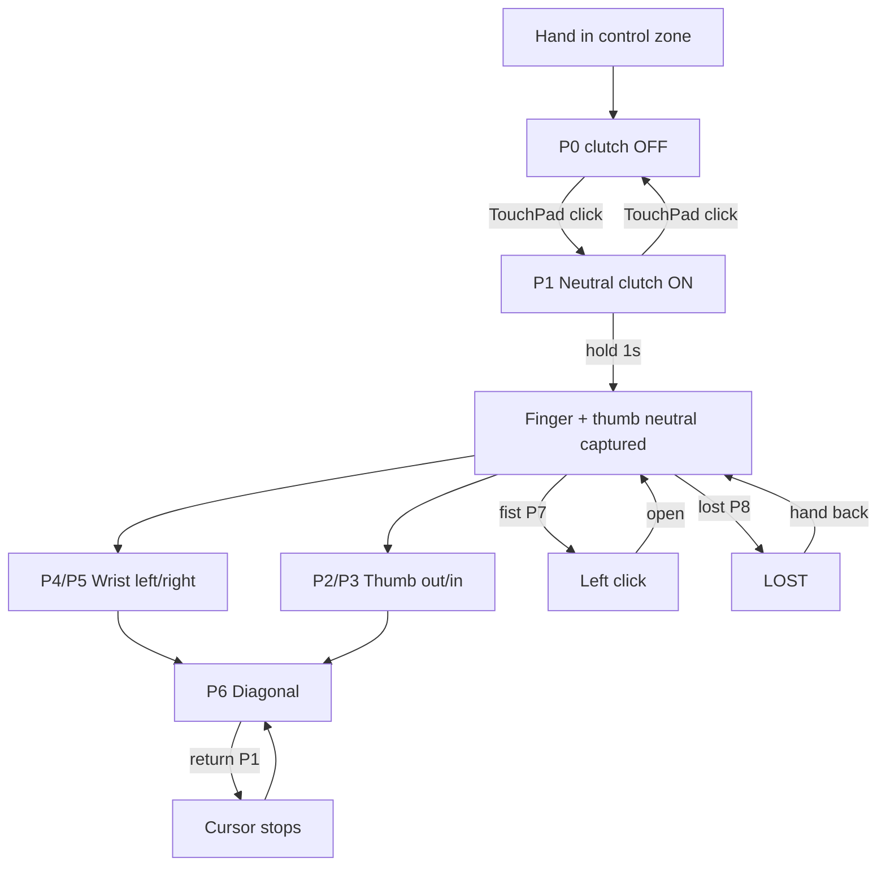

# Stage 6 — Hand Posture Guide (Dual-Axis + Fist)

Visual reference for **手势鼠标 · Stage 6**.  
**Horizontal:** four fingers (index / middle / ring / pinky) — rotate wrist left/right.  
**Vertical:** thumb — **out** = cursor up, **toward palm** = cursor down.  
**Click:** full **fist**. Axes combine for **diagonal** motion.

Related: [`stage-6-pointing-fist-control-case.md`](stage-6-pointing-fist-control-case.md) · [`../test_usage.md`](../test_usage.md)

---

## 1. Where to hold your hand (control zone)

```text
                    (ceiling)
                        │
         ┌──────────────┼──────────────┐
         │   outside FOV — no tracking  │
         │                              │
         │      ┌──────────────┐        │
         │      │  CONTROL     │        │  ← raise hand here
         │      │  ZONE        │        │     (upper chest /
         │      │  palm toward │        │      in front of face)
         │      │  camera      │        │
         │      └──────────────┘        │
         │                              │
         │   desk / lap — too low ✗     │
         └──────────────────────────────┘
                    (floor)
```

| OK | Not OK |
|----|--------|
| Hand in front of face, upper chest height | Hand on desk / keyboard |
| Palm roughly toward camera | Hand at side, out of frame |
| One hand, stable elbow | Waving arm across room |

---

## 2. Finger / thumb roles (dual-axis)

```text
    THUMB  ──► vertical axis (dy)
               · thumb OUT (away from palm)     → cursor UP
               · thumb IN (toward palm)         → cursor DOWN
               · neutral spread at calibration  → no vertical move

    INDEX + MIDDLE + RING + PINKY  ──► horizontal axis (dx)
               · rotate wrist left/right vs neutral → cursor LEFT / RIGHT
               · all four extended (min ~50% curl ratio)

    FIST (all fingers + thumb tucked) ──► left click; motion stopped
```

**Geometry (display space, after `HandDisplayTransform`):**

| Signal | Source |
|--------|--------|
| Finger aim angle | Average of four fingertip directions vs knuckle midpoint |
| Thumb spread | Thumb tip distance from palm center (index+middle MCP midpoint) |
| Neutral | Both captured on first valid frame after **clutch ON** |

---

## 3. Required postures (wearer view)

Hand faces camera; **back of hand** toward lens is typical.

### P0 — Rest (clutch OFF)

```text
         ✋  relaxed
    clutch OFF → IDLE, no UDP motion
```

---

### P1 — Neutral (clutch ON, cursor STOP)

Hold ~1 s after clutch on — **calibrates finger angle + thumb spread**.

```text
         🖐️
        /│││\   four fingers extended, relaxed
         │👍│   thumb neutral (not out, not tucked)
         
    dx=0  dy=0  (inside dead zones)
```

---

### P2 — Cursor UP (thumb OUT)

```text
         🖐️
        /│││\
       👍      thumb points OUT / away from palm
       
    dy < 0 on laptop (up) · dx unchanged if fingers stay neutral
```

---

### P3 — Cursor DOWN (thumb IN)

**Not a fist** — fingers stay extended; only thumb folds toward palm.

```text
         🖐️
        /│││\
         👍←   thumb tucked toward palm
       
    dy > 0 (down) · still NOT P7 fist
```

---

### P4 — Cursor LEFT / P5 — RIGHT

Rotate **wrist**; keep thumb neutral unless also moving vertically.

```text
    ← 🖐️══   P4 left          P5 right  🖐️══ →
       four fingers aim left/right vs P1 neutral
       
    dx ≠ 0 · dy=0 if thumb neutral
```

---

### P6 — Diagonal (e.g. up-left)

Combine P2 + P4 (or any vertical + horizontal) **at the same time**.

```text
       👍 out + fingers aim left  →  ↖ on laptop
       
    dx and dy both non-zero
```

---

### P7 — FIST (left click)

**All** fingers curled; thumb tucked. Distinct from P3 (thumb only).

```text
         👊
    FIST → left button DOWN, dx=0 dy=0
    open hand → left button UP (after hold/cooldown)
```

---

### P8 — Invalid / LOST

```text
    ✗ hand out of frame
    ✗ fingers collapsed (not fist, not extended)
    ✗ only one finger extended

    → LOST: freeze cursor, release button
```

---

## 4. Posture map on HUD

```text
    ┌──────────────── 480 ────────────────┐  ▲
    │                 UP                   │  thumb OUT
    │                  ↑                   │
    │         ← LEFT   ·   RIGHT →         │  four-finger aim
    │                  ↓                   │
    │                DOWN                  │  thumb IN
    └─────────────────────────────────────┘  ▼

    ·  = P1 neutral (stop)
    ↖↗↙↘ = combine thumb + finger offsets
```

---

## 5. Full session flow



---

## 6. Do / Don't

| Do | Don't |
|----|-------|
| **Thumb out/in** for up/down | Tilt whole hand up/down with fingers only |
| **Wrist rotation** for left/right | Translate arm across body |
| Return to **P1 neutral** to stop | Expect stop while thumb/fingers still offset |
| **Fist (P7)** for click | Thumb-in (P3) for click — that is move down |
| Re-clutch to re-calibrate | Fight drift by moving hand in space |

---

## 7. Quick reference table

| Posture | Hand shape | Clutch | Cursor | Click |
|---------|------------|--------|--------|-------|
| P0 Rest | any | OFF | idle | — |
| P1 Neutral | 🖐️ four extended, thumb neutral | ON | **stop** | — |
| P2 Up | 🖐️ thumb **out** | ON | move **↑** | — |
| P3 Down | 🖐️ thumb **in** (fingers open) | ON | move **↓** | — |
| P4 Left | 🖐️ aim ← | ON | move **←** | — |
| P5 Right | 🖐️ aim → | ON | move **→** | — |
| P6 Diagonal | thumb + finger offset | ON | move ↖↗↙↘ | — |
| P7 Fist | 👊 all curled | ON | **stop** | **down** |
| P8 Lost | ✗ / out of frame | ON | freeze | release |

---

## 8. TouchPad & key codes (GlassesBareDevSample)

On **RG-glasses** firmware, hub navigation uses **KeyEvents** (mapped in `TouchPadSwipeDetector`).  
Ordered **broadcasts** are a fallback on some builds.

### Hub & global UI

| Gesture | Android `KeyEvent` | Code | `BareKeyEvent` | Hub action |
|---------|-------------------|------|----------------|------------|
| TouchPad **single click** | `KEYCODE_ENTER` | 66 | `Click` | Enter selected scene |
| TouchPad **double click** | `KEYCODE_BACK` | 4 | `DoubleClick` | Exit app |
| TouchPad **long press** | `KEYCODE_PROG_BLUE` | 186 | `LongPress` | Scene-specific |
| Swipe **forward** (slow) | `KEYCODE_DPAD_RIGHT` | 22 | `SwipeForward` | Next hub item |
| Swipe **back** (slow) | `KEYCODE_DPAD_LEFT` | 21 | `SwipeBack` | Previous hub item |
| Swipe **forward** (fast) | `DPAD_RIGHT` + `DPAD_DOWN` | 22 + 20 | `SwipeForward` | Next hub item |
| Swipe **back** (fast) | `DPAD_LEFT` + `DPAD_UP` | 21 + 19 | `SwipeBack` | Previous hub item |
| (consumed, no UI) | `KEYCODE_NOTIFICATION` | 83 | — | — |
| Settings (consumed) | `KEYCODE_SETTINGS` | — | — | — |

### Ordered broadcasts (fallback / abort in sample)

| Gesture | Intent action | Maps to |
|---------|---------------|---------|
| TouchPad long press | `com.android.action.ACTION_AI_START` | `LongPress` |
| Two-finger swipe forward | `com.android.action.ACTION_TWO_FINGER_SWIPE_FORWARD` | `SwipeForward` |
| Two-finger swipe back | `com.android.action.ACTION_TWO_FINGER_SWIPE_BACK` | `SwipeBack` |
| Temple button click | `com.android.action.ACTION_SPRITE_BUTTON_CLICK` | `Click` |
| Two-finger long press | `com.android.action.ACTION_SETTINGS_KEY` | (abort only) |

Source: `KeyEvents.kt`, `MainActivity.kt`, `BareGlassesInputDispatcher.kt`.

### 手势鼠标 · Stage 6 scene

| Gesture | Key / event | Action |
|---------|-------------|--------|
| Single click | `KEYCODE_ENTER` | Toggle clutch (off by default); **captures P1 neutral** when enabling |
| Double click | `KEYCODE_BACK` | Back to hub; release buttons |
| Long press | `KEYCODE_PROG_BLUE` / `ACTION_AI_START` | Save link config to device |
| Swipe forward/back | DPAD keys (see above) | Ignored in hand-mouse scene |

---

## 9. Laptop mouse agent (companion)

| Control | Action |
|---------|--------|
| **ARM** button (slider window) | Agent accepts motion packets |
| Type **`a`** + Enter in cmd window | Arm (if GUI/hotkeys fail) |
| Type **`d`** + Enter | Disarm |
| **`start_mouse_agent.bat`** | Starts with **`--auto-arm`** by default |
| Glasses clutch **on** | Sends `output_enabled` packets |

Both **agent ARMED** and **glasses clutch on** are required for cursor motion.

---

## 10. If directions feel wrong on laptop

Edit [`HandMouseConfig.kt`](../GlassesBareDevSample/app/src/main/java/com/rokid/glassesbaredevsample/hand/HandMouseConfig.kt):

```kotlin
pointingFlipY = true   // flip up/down (thumb axis)
pointingFlipX = true   // flip left/right (finger axis)
```

Tune thumb/finger thresholds:

```kotlin
thumbVerticalDeadzone = 0.06f
thumbVerticalMaxDelta = 0.16f
thumbOpenMinExtension   // legacy; vertical uses spread vs neutral
pointingDeadzoneDeg = 15f
```

Rebuild APK. Laptop **gain slider** changes speed only, not direction.

---

## 11. HUD lines to watch

| HUD | Meaning |
|-----|---------|
| `姿态: 四指转腕=左右 · 拇指外展=上/贴掌=下 · 握拳=左键` | Current scheme |
| `pose=OK` | P1–P6 valid (four fingers extended) |
| `pose=—` | P8 invalid shape |
| `瞄准偏角: …°` | Finger offset from neutral (horizontal) |
| `手势: FIST` | P7 clicking |
| `手势: LOST` | P8 |
| `输出: 已启用` | Clutch on |

---

## 12. Legacy mode (not default)

**Palm translation + pinch** — only if `controlScheme = TRANSLATION_PINCH`:

```text
    move hand in space → cursor moves
    thumb + index pinch → click
```

Default: **Stage 6 dual-axis + fist** (this guide).
