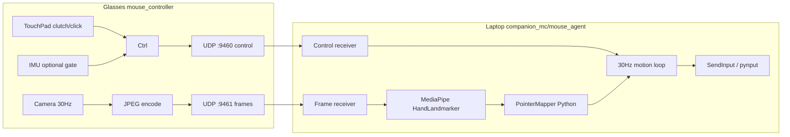

# 30 Hz Laptop-Side MediaPipe Mouse Control

> Saved from Cursor plan `30Hz Laptop MediaPipe-5399bf79` (2026-08-09).

## Implementation todos

- [ ] **Protocol RKFR:** Define FrameLinkPacket (RKFR) + optional landmark feedback; add Kotlin encoder and Python decoder with HMAC
- [ ] **Glasses encoder:** Add FrameJpegEncoder + UdpFrameLinkClient; rewrite HandMouseScreen analyzer to capture-only (no MediaPipe)
- [ ] **Glasses ViewModel:** Rewrite HandMouseViewModel: 30 Hz frameTick + controlTick loops, remove on-device PointerMapper motion path, add LAPTOP_INFERENCE config
- [ ] **Laptop tracker:** Add mediapipe + hand_tracker.py + pointer_mapper.py (port TouchGatedTrackpad + display rotation)
- [ ] **Laptop agent:** Extend mouse_agent.py: dual UDP ports, 30 Hz motion loop, recenter/pause handling, update requirements + model asset
- [ ] **Tests & docs:** Add unit tests (RKFR, pointer_mapper) and update README / test_usage for new pairing ports

---

## Problem

Today the glasses run the full hot path: **Camera (~30 FPS) → MediaPipe CPU → PointerMapper → UDP → pynput**. That causes:

- Bursty motion tied to irregular inference (p95 ~80 ms on AR1 CPU)
- Thermal / battery drain from sustained ML on 2 GB Low-RAM device
- Head–hand coupling amplified by on-device static posture schemes

Your target: **stable 30 Hz** with **MediaPipe on the laptop**, glasses as a thin sensor/stream client.



---

## Recommended control mode

**Primary: Solution A (Touch-Gated Trackpad)** — matches the research plan and fits laptop inference cleanly:

| Input | Where |
|-------|--------|
| TouchPad click | Glasses → clutch ON/OFF via control packet |
| TouchPad tap | Glasses → `left_pressed` in control packet |
| TouchPad long-press | Glasses → `FLAG_RECENTER` one-shot |
| Hand motion | Laptop MediaPipe → palm/index delta → mouse |
| IMU | Optional head-jerk gate on glasses only (no pointer motion) |

**Phase 2 (optional):** Hybrid C — glasses send IMU `dx/dy` on control channel at 30 Hz; laptop blends 80/20 with hand fine layer ([`HybridPointerBlender.kt`](../mouse_controller/app/src/main/java/com/rokid/glassesbaredevsample/sensor/HybridPointerBlender.kt)).

---

## 30 Hz timing model

| Layer | Rate | Responsibility |
|-------|------|----------------|
| Camera capture | ~30 FPS | CameraX `STRATEGY_KEEP_ONLY_LATEST` |
| Frame sender | **33 ms fixed** | Grab latest RGBA → rotate → JPEG → UDP |
| Control sender | **33 ms fixed** | Clutch state, click, recenter, optional IMU |
| Laptop inference | **33 ms fixed** | Decode JPEG → MediaPipe VIDEO mode → landmarks |
| Laptop motion loop | **33 ms fixed** | Pointer delta + scale + inject (even if no new frame, inject 0) |

Key rule: **decouple send rate from camera arrival**. Camera thread only updates `AtomicReference<LatestFrame>`; a dedicated scheduler emits at 30 Hz (same pattern as existing IMU loop in [`HandMouseViewModel.kt`](../mouse_controller/app/src/main/java/com/rokid/glassesbaredevsample/activities/handmouse/HandMouseViewModel.kt) lines 764–787, but at `33 ms` not `16 ms`).

---

## Protocol extensions

Keep existing [`MouseLinkPacket`](../mouse_controller/app/src/main/java/com/rokid/glassesbaredevsample/link/MouseLinkPacket.kt) on **port 9460** for control. In laptop-inference mode:

- `dx/dy` from glasses = **IMU only** (0 for Solution A)
- `hand_ok` = computed on laptop (not sent from glasses)
- New flag `FLAG_RECENTER = 1 << 3` — laptop resets pointer anchor
- Heartbeat stays at 50 ms (unchanged)

Add new **FrameLinkPacket** on **port 9461** (glasses → laptop):

```
magic u32 = 0x524B4652  ("RKFR")
version u8 = 1
flags u8  (bit0: output_enabled)
sessionId u16, sequence u32, tMs u32
rotationDeg u16, width u16, height u16
jpegLen u16, jpeg[jpegLen], authTag[8]
```

- Target resolution: **320×240 JPEG quality ~65** (~8–20 KB/frame → ~240–600 KB/s at 30 Hz, fine on Wi‑Fi 6)
- Same HMAC token as motion link
- MTU-safe: if JPEG > ~1200 B, use simple **chunk sub-packets** (seq + chunkIndex + chunkTotal) or cap quality

Optional **LandmarkFeedbackPacket** laptop → glasses **:9462** (for HUD overlay only):

- 21 landmarks × 3 × float16 ≈ 126 B + header — lets glasses draw [`HandLandmarkOverlay`](../mouse_controller/app/src/main/java/com/rokid/glassesbaredevsample/ui/handmouse/HandLandmarkOverlay.kt) without running MediaPipe

---

## Glasses changes ([`mouse_controller`](../mouse_controller))

### 1. New config mode

In [`HandMouseConfig.kt`](../mouse_controller/app/src/main/java/com/rokid/glassesbaredevsample/hand/HandMouseConfig.kt):

- Add `ControlScheme.LAPTOP_INFERENCE` (or `frameStreamPort = 9461` flag)
- Set as `Default` for this rewrite
- `usesCameraForPointer() = true`, `usesOnDeviceMediaPipe() = false`

### 2. Rewrite [`HandMouseViewModel.kt`](../mouse_controller/app/src/main/java/com/rokid/glassesbaredevsample/activities/handmouse/HandMouseViewModel.kt)

This is the core “rewrite this function” target:

**Remove from hot path:**
- `onHandFrame()` → MediaPipe + `PointerMapper.update()` + immediate UDP motion
- Hybrid `latestHandFine` / per-frame hand dx on glasses

**Add:**
- `onCameraFrame(jpegBytes, rotation, tMs)` — store latest frame ref
- `frameTick()` @ 33 ms — send `FrameLinkPacket` when clutch ON
- `controlTick()` @ 33 ms — send `MouseLinkPacket` with clutch/click/recenter; `dx=dy=0` for Solution A
- `onLandmarkFeedback()` — update UI state for overlay (optional)
- Unified `startMotionLoop()` at **30 Hz** for both frame + control ticks (replace separate 60 Hz IMU tick unless hybrid phase 2)

**Keep on glasses:**
- TouchPad handlers (`onTouchPadTap`, `onTouchPadLongPress`, etc.)
- `HeadJerkMonitor` — set `motionPaused` flag forwarded in control packet for laptop to zero hand dx
- Link gain sync (unchanged)
- IMU code dormant for Solution A; wire in phase 2 for hybrid

### 3. Rewrite [`HandMouseScreen.kt`](../mouse_controller/app/src/main/java/com/rokid/glassesbaredevsample/activities/handmouse/HandMouseScreen.kt) analyzer

Replace:

```kotlin
val result = landmarkerEngine.detect(image)
viewModel.onHandFrame(...)
```

With:

```kotlin
val jpeg = frameEncoder.encode(image)  // RGBA → Bitmap → JPEG
viewModel.onCameraFrame(jpeg, rotationDegrees, timestampMs)
```

- Remove `HandLandmarkerEngine` init/dispose in laptop-inference mode
- Remove MediaPipe dependency from release build variant (optional `build.gradle.kts` flavor to shrink APK)

### 4. New Kotlin files

| File | Purpose |
|------|---------|
| `link/FrameLinkPacket.kt` | Encode RKFR + HMAC |
| `link/UdpFrameLinkClient.kt` | Send frames to `:9461` |
| `camera/FrameJpegEncoder.kt` | RGBA ImageProxy → JPEG bytes, reuse bitmap buffer |
| `link/LandmarkFeedbackReceiver.kt` | Optional UDP recv for HUD landmarks |

### 5. Remove / gate on-device ML

- [`HandLandmarkerEngine.kt`](../mouse_controller/app/src/main/java/com/rokid/glassesbaredevsample/hand/HandLandmarkerEngine.kt) — keep behind debug flag only
- Drop `assets/ml/hand_landmarker.task` from main APK (~MB savings)

---

## Laptop changes ([`companion_mc/mouse_agent`](../companion_mc/mouse_agent))

### 1. Dependencies ([`requirements.txt`](../companion_mc/mouse_agent/requirements.txt))

```
pynput==1.8.1
mediapipe>=0.10.14
opencv-python-headless>=4.8
numpy>=1.24
Pillow>=10.0
```

Download `hand_landmarker.task` into `mouse_agent/models/` (same model glasses used).

### 2. New Python modules

| Module | Port from Kotlin |
|--------|------------------|
| `hand_tracker.py` | [`HandLandmarkerEngine.kt`](../mouse_controller/app/src/main/java/com/rokid/glassesbaredevsample/hand/HandLandmarkerEngine.kt) — VIDEO mode, 1 hand |
| `pointer_mapper.py` | [`PointerMapper.updateTouchGatedTrackpad`](../mouse_controller/app/src/main/java/com/rokid/glassesbaredevsample/hand/PointerMapper.kt) + [`HandDisplayTransform`](../mouse_controller/app/src/main/java/com/rokid/glassesbaredevsample/hand/HandDisplayTransform.kt) rotation (270° CW) |
| `frame_link.py` | RKFR decode + guard |
| `motion_loop.py` | Fixed 33 ms thread: latest landmarks + latest control state → scaled move |

### 3. Extend [`mouse_agent.py`](../companion_mc/mouse_agent/mouse_agent.py)

Restructure `MouseAgent` into dual-input:

```python
# Pseudocode structure
class MouseAgent:
    def on_control_packet(decoded):   # port 9460 — clutch, click, recenter, imu_dx/dy
    def on_frame_packet(jpeg, meta):  # port 9461 — decode → hand_tracker.detect()
    def motion_tick_30hz():           # blend → scale_motion → inject
```

- **Control path** (existing): apply click/wheel immediately; store `output_enabled`, `recenter`, `motion_paused`
- **Frame path** (new): run MediaPipe; update `PointerMapper` state
- **30 Hz loop** (new): if armed + output_enabled: compute dx/dy from mapper (respect pause/recenter), apply gain + screen scale, inject relative move
- Add `--frame-port 9461`, `--motion-hz 30`
- Prefer **SendInput via ctypes** for injection (lower jitter than pynput; mentioned in research plan)

### 4. Threading model

```
Thread 1: UDP recv 9460 (control) — existing
Thread 2: UDP recv 9461 (frames) — decode JPEG, push to tracker queue (drop stale)
Thread 3: motion_loop @ 30 Hz — pointer math + mouse inject
Thread 4: watchdog — existing 200 ms timeout
Thread 5: optional landmark feedback sender → glasses :9462
```

### 5. Tests

Extend [`test_mouse_agent.py`](../companion_mc/mouse_agent/test_mouse_agent.py):

- RKFR packet round-trip encode/decode
- `PointerMapper` delta deadzone (port of Kotlin unit tests from [`PointerControlTest.kt`](../mouse_controller/app/src/test/java/com/rokid/glassesbaredevsample/hand/PointerControlTest.kt))
- 30 Hz loop emits zero motion when clutch off

---

## End-to-end user flow (unchanged UX)

1. Start `start_mouse_agent.bat` on laptop (auto-arm)
2. Glasses Hand Mouse scene → TouchPad click → clutch ON
3. Glasses stream JPEG @ 30 Hz; laptop tracks hand @ 30 Hz
4. Move hand → cursor moves; TouchPad tap → click; long-press → recenter
5. TouchPad click again → clutch OFF, frame stream stops (thermal save)

---

## Implementation phases

### Phase 1 — Minimal working 30 Hz (Solution A)
- Frame protocol + glasses encoder + laptop MediaPipe + Python pointer mapper
- Rewrite `HandMouseViewModel` + `HandMouseScreen` analyzer
- Control packets carry clutch/click/recenter only

### Phase 2 — Polish
- Landmark feedback to glasses HUD
- SendInput default; motion smoothing on laptop
- Head-jerk `motion_paused` flag end-to-end

### Phase 3 — Optional hybrid
- Glasses IMU @ 30 Hz on control channel; laptop `HybridPointerBlender` in Python

---

## Success metrics

- Glasses analyzed FPS metric replaced by **frame send FPS ≥ 29 stable**
- Laptop inference p95 **< 25 ms** (typical on modern laptop CPU)
- End-to-end glass-move → cursor-move p95 **< 100 ms**
- 30 min run: glasses no MediaPipe thermal throttling; camera stays bound

---

## Key files summary

| Side | Files |
|------|-------|
| Glasses | [`HandMouseViewModel.kt`](../mouse_controller/app/src/main/java/com/rokid/glassesbaredevsample/activities/handmouse/HandMouseViewModel.kt), [`HandMouseScreen.kt`](../mouse_controller/app/src/main/java/com/rokid/glassesbaredevsample/activities/handmouse/HandMouseScreen.kt), [`HandMouseConfig.kt`](../mouse_controller/app/src/main/java/com/rokid/glassesbaredevsample/hand/HandMouseConfig.kt), new `FrameLink*` + `FrameJpegEncoder` |
| Laptop | [`mouse_agent.py`](../companion_mc/mouse_agent/mouse_agent.py), new `hand_tracker.py`, `pointer_mapper.py`, `frame_link.py`, [`requirements.txt`](../companion_mc/mouse_agent/requirements.txt) |
