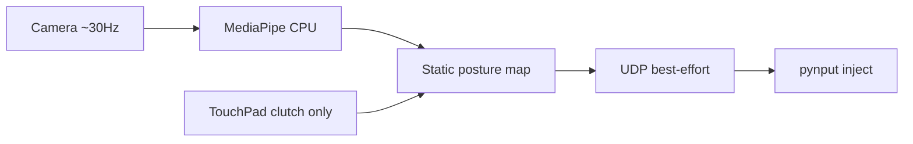
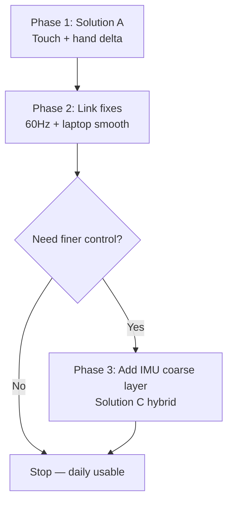

# Optimal Mouse Control — Research & Solution Plan

> Saved from Cursor plan `Mouse Control Research-d688c405` (2026-08-09).

## Implementation todos

- [x] **Phase 1 — Solution A:** switch to `TRANSLATION_PINCH` motion, TouchPad tap for click, remove fist from default scheme
- [ ] **Phase 2 — Link fixes:** 60 Hz fixed-rate UDP sender on glasses + laptop-side motion interpolation/smoothing in `mouse_agent.py`
- [x] **Phase 2 — IMU gate:** head-jerk auto-pause to prevent head-turn drift during hand tracking
- [x] **Phase 3 — Hybrid (Solution C):** IMU coarse 80% + index-tip fine 20% when hand visible
- [ ] **UX simplify:** HUD to OFF/MOVE/CLICK states; update `test_usage.md` with new gesture map

---

## Field notes (hardware trials, 2026-08-09)

### Single-source dx/dy control — not good enough alone

| Scheme | Motion source | Verdict |
|--------|---------------|---------|
| **A** — hand trackpad | Palm/index translation deltas @ ~30 Hz | **Fatiguing** — holding hand in FOV and moving arm continuously is tiring; rule-based posture also caused drift and false moves. |
| **B** — IMU head pointer | Head yaw/pitch deltas @ 60 Hz | **Hard to control** — pure per-tick dx/dy from head rotation feels jumpy and unintuitive; small target precision poor; users report dx/dy framing does not map well to “where I want the cursor.” |

**Takeaway:** A single sensor driving 100% of relative dx/dy is insufficient. Plan **C** (IMU coarse + hand fine blend) is the current default: head for large moves, index tip for correction when hand is visible, TouchPad for all clicks.

---

## Current Problem Diagnosis

Your Stage 6 scheme in [`PointingController.kt`](../GlassesBareDevSample/app/src/main/java/com/rokid/glassesbaredevsample/hand/PointingController.kt) maps **two independent static postures** simultaneously:

- **Horizontal:** wrist rotation vs calibrated finger aim angle (15° dead zone, 40° max)
- **Vertical:** thumb spread vs calibrated neutral
- **Click:** full fist (5 curl thresholds + hysteresis)

This creates three structural HCI failures:

1. **Ambiguous neutral** — holding P1 (four fingers extended + thumb neutral) is cognitively heavy; micro-changes in curl/angle cross dead-zone boundaries and produce unintentional drift.
2. **Head–hand coupling** — the 109° camera is head-mounted. A stationary hand moves in image space when you turn your head (documented risk in [`hand-pose-mouse-control.md`](../agent_plan/hand-pose-mouse-control.md) §Main concerns #3). Static posture amplifies this because there is no explicit "move intent" signal.
3. **Low-rate, bursty pipeline** — motion is tied to camera analysis (~30 Hz, CPU MediaPipe) over UDP with no laptop-side interpolation:



Typical end-to-end latency: **80–200 ms+** (inference + Wi-Fi jitter + Python injection). Variable frame drops (`STRATEGY_KEEP_ONLY_LATEST`) cause stutter. Heartbeat is 50 ms but motion packets are irregular.

---

## Part 1 — Rokid AI Glasses Hardware & Remote Control

### Compute & sensing (RG-glasses / RV101)

| Component | Spec | Implication for mouse control |
|-----------|------|--------------------------------|
| **SoC** | Snapdragon AR1 Gen 1 (Kryo 4×1.9 GHz) + NXP RT600 co-processor | Main compute on AR1; RT600 handles always-on audio/KWS |
| **RAM** | 2 GB, **Low RAM Mode enabled** | Tight for sustained camera + ML; avoid running heavy vision continuously |
| **NPU** | Hexagon 3rd-gen (INT4/INT8) + Micro NPU on Sensing Hub | Present but **no native hand-tracking stack** (unlike AR2 Gen 1); current app uses MediaPipe on **CPU only** |
| **Camera** | 12 MP Sony IMX681, 109° FOV, fixed focus (34 cm–∞), 3° inward tilt | Wide FOV helps hand visibility; fixed focus OK at chest height; head motion = image motion |
| **Display** | JBD Micro-LED **480×640**, 30° FOV | Sparse HUD only; no room for complex gesture menus |
| **IMU** | InvenSense ICM-4x6xx (accel + gyro, I3C) | Already wired in [`HeadOrientationTracker.kt`](../GlassesBareDevSample/app/src/main/java/com/rokid/glassesbaredevsample/sensor/HeadOrientationTracker.kt) at `SENSOR_DELAY_GAME` (~100–200 Hz) |
| **TouchPad** | Temple bar: click, double-click, long-press, swipe F/B, two-finger gestures | Fully integrated via [`BareGlassesInputDispatcher.kt`](../GlassesBareDevSample/app/src/main/java/com/rokid/glassesbaredevsample/input/BareGlassesInputDispatcher.kt) |
| **Battery** | 210 mAh | Sustained camera+ML causes thermal throttling over 10+ min |
| **Connectivity** | Wi-Fi 6, BT 5.3 | Current link: plain UDP LAN; Glass3 SDK also offers Wi-Fi P2P for lower-latency channels (not used yet) |

### Measured performance in this project

From [`stage-1-developing_step_logs.md`](../agent_plan/stage-1-developing_step_logs.md) and [`stage-2-mediapipe-log.md`](../agent_plan/stage-2-mediapipe-log.md):

- Camera analysis: **~29.7 FPS** at 480×640, rotation 270°
- MediaPipe Hand Landmarker: **PASS** on RG-glasses (CPU, RGBA 640×480)
- Target gate: ≥15 analyzed FPS, p95 inference ≤80 ms

### Current remote control stack

| Layer | Detail |
|-------|--------|
| Protocol | `MouseLinkPacket` v1 — 29-byte UDP, HMAC auth ([`MouseLinkPacket.kt`](../GlassesBareDevSample/app/src/main/java/com/rokid/glassesbaredevsample/link/MouseLinkPacket.kt)) |
| Port / rate | `:9460`, one packet per analyzed frame + 50 ms heartbeat |
| Safety | Dual-arm: laptop agent ARM + glasses TouchPad clutch |
| Laptop | [`mouse_agent.py`](../companion/mouse_agent/mouse_agent.py) — gain slider, 200 ms RX timeout, pynput |
| Unused sensors | IMU demo only ([`ImuScreen.kt`](../GlassesBareDevSample/app/src/main/java/com/rokid/glassesbaredevsample/activities/imu/ImuScreen.kt)); TouchPad = clutch gate only |

---

## Part 2 — Design Principles (Simple HCI)

Apply these across all solutions:

1. **One sensor, one job** — never ask posture to mean both "move" and "click"
2. **Explicit gates for continuous motion** — TouchPad clutch stays; add recenter on long-press
3. **Dynamic deltas over static poses** — track *change* from last frame, not offset from calibrated neutral
4. **Discrete actions on TouchPad** — clicks and mode switches belong on the 100%-reliable input
5. **Decouple motion rate from camera** — IMU or fixed timer at 60 Hz; camera optional or reduced duty
6. **Laptop-side smoothing** — use packet `tMs` + sequence for interpolation, not raw per-packet jumps

---

## Part 3 — Three Proposed Solutions

### Solution A — Touch-Gated Air Trackpad (simplest; recommended first)

**Best for:** users who want hand-based pointing, minimal learning curve, no head motion.

| Input | Role |
|-------|------|
| **TouchPad click** | Toggle pointer ON/OFF (clutch — keep existing) |
| **TouchPad tap while ON** | Left click (replaces fist) |
| **TouchPad long-press while ON** | Recenter / re-anchor |
| **TouchPad swipe F/B while ON** | Scroll wheel |
| **Hand (camera)** | **Palm-center or index-tip delta** — revert to Stage 3 `TRANSLATION_PINCH` motion only; drop fist |
| **IMU** | **Gate only:** detect large head jerk → auto-pause output for 300 ms (prevents head-turn drift) |

**Why it fixes your issues:**
- Removes dual-axis static posture (no P1 neutral calibration dance)
- Fist → TouchPad click eliminates the biggest false-trigger source
- Translation delta behaves like a trackpad: move hand → cursor moves, stop → cursor stops
- IMU used only as safety filter, not as primary pointer (no gyro drift)

**Complexity:** Low — mostly config + remap in [`PointerMapper.kt`](../GlassesBareDevSample/app/src/main/java/com/rokid/glassesbaredevsample/hand/PointerMapper.kt); reuse existing `ControlScheme.TRANSLATION_PINCH`.

```mermaid
stateDiagram-v2
  [*] --> Idle
  Idle --> Tracking: TouchPad_click_ON
  Tracking --> Idle: TouchPad_click_OFF
  Tracking --> Tracking: hand_delta_to_dxdy
  Tracking --> Click: TouchPad_tap
  Click --> Tracking: tap_release
```

---

### Solution B — IMU Head Pointer + Touch Click (most stable motion)

**Best for:** browsing, large cursor movements, reduced arm fatigue; proven on Rokid (see [RokidGames](https://github.com/ARDings/RokidGames) 3DOF pattern).

| Input | Role |
|-------|------|
| **TouchPad click** | Toggle pointer ON/OFF |
| **TouchPad tap while ON** | Left click |
| **TouchPad long-press while ON** | Recenter head pose (calibrate IMU reference) |
| **IMU gyro** | **Primary motion:** head yaw → dx, pitch → dy at **60 Hz** independent of camera |
| **Hand (camera)** | **Optional:** pinch = click backup when hand visible; camera can run at lower rate or be off |
| **TouchPad swipe** | Scroll |

**Why it fixes your issues:**
- IMU updates at 5–10× camera rate → smoother, lower latency motion path
- No posture rules at all for movement
- Camera/ML can be disabled in pointer mode → less heat, longer battery
- Head motion is intentional for pointing (like a laser cursor)

**Tradeoffs:**
- Fine desktop work (small targets) may feel less precise than a trackpad
- Gyro drift over 2–5 min → mitigated by TouchPad long-press recenter
- Some users dislike head-based pointing for laptop work

**Implementation sketch:** new `ImuPointerController` alongside [`HeadOrientationTracker.kt`](../GlassesBareDevSample/app/src/main/java/com/rokid/glassesbaredevsample/sensor/HeadOrientationTracker.kt); send UDP from a dedicated 60 Hz thread in [`HandMouseViewModel.kt`](../GlassesBareDevSample/app/src/main/java/com/rokid/glassesbaredevsample/activities/handmouse/HandMouseViewModel.kt).

---

### Solution C — Hybrid Layered Control (best long-term balance)

**Best for:** combining coarse speed (head) with fine precision (hand) without static postures.

| Input | Role |
|-------|------|
| **TouchPad click** | Toggle pointer ON/OFF |
| **TouchPad tap** | Left click |
| **TouchPad long-press** | Recenter both IMU + hand anchor |
| **TouchPad swipe** | Scroll |
| **IMU** | **Coarse layer (80%):** head yaw/pitch delta at 60 Hz |
| **Hand index tip** | **Fine layer (20%):** translation delta when hand detected; blended only when `handOk` flag set |
| **Fist** | Removed |

**Blending formula (when hand present):**
```
dx = imu_dx * 0.8 + hand_dx * 0.2
dy = imu_dy * 0.8 + hand_dy * 0.2
```

**Why it fixes your issues:**
- Solves head–hand coupling: IMU handles head turns; hand adds fine correction only when visible
- No static posture calibration
- Highest ceiling for usability once tuned

**Tradeoffs:** Most engineering effort; two motion sources need careful gain tuning.

---

## Part 4 — Cross-Cutting Link & Latency Fixes (all solutions)

These address the "unstable movements and delays" regardless of which scheme you pick:

| Fix | Where | What |
|-----|-------|------|
| **Fixed-rate sender** | Glasses `HandMouseViewModel` | Dedicated 60 Hz executor for motion packets; camera thread only updates latest delta |
| **Laptop interpolation** | `mouse_agent.py` | Use `tMs` to interpolate between last 2 packets; cap velocity |
| **Adaptive deadzone** | `PointerMapper` / new IMU controller | Scale deadzone with hand/head speed (small movements need larger deadzone) |
| **Native injection** | Laptop agent | Replace pynput with `SendInput` ctypes path (already partially in agent) for ~5–10 ms less jitter |
| **Optional: reduce camera duty** | Solution B/C | Run MediaPipe at 15 Hz or only when hand enters FOV; IMU fills gaps |
| **HUD simplification** | `HandMouseScreen` | Show 3 states only: `OFF` / `MOVE` / `CLICK` — hide landmark debug in normal use |

---

## Part 5 — Recommended Path



**Start with Solution A** because:
- Smallest code change (switch to `TRANSLATION_PINCH`, move click to TouchPad)
- Directly addresses your stated problem with rule-based static posture
- Keeps hand-based interaction you already practice
- IMU safety gate is a small add-on from existing [`HeadOrientationTracker`](../GlassesBareDevSample/app/src/main/java/com/rokid/glassesbaredevsample/sensor/HeadOrientationTracker.kt)

If arm fatigue or head-drift during turns remains annoying after Phase 1+2, add Solution C's IMU coarse layer.

---

## Part 6 — Simplified Daily Usage Flow (target UX)

Reduce steps from current dual-arm + posture calibration:

1. Launch app → auto-enter Hand Mouse scene (skip hub)
2. Laptop agent auto-arms on startup (already supported via `--auto-arm`)
3. **TouchPad click once** → pointer ON, hand anchor captured automatically
4. **Move hand** → cursor moves (like trackpad)
5. **TouchPad tap** → click
6. **TouchPad click again** → pointer OFF (rest hand freely)
7. **TouchPad long-press** → recenter if drift

No fist. No P1 neutral hold. No thumb-spread vertical axis.

---

## Key Files to Change (when implementing)

| File | Change |
|------|--------|
| [`HandMouseConfig.kt`](../GlassesBareDevSample/app/src/main/java/com/rokid/glassesbaredevsample/hand/HandMouseConfig.kt) | New scheme enum; TouchPad-click mode defaults |
| [`PointerMapper.kt`](../GlassesBareDevSample/app/src/main/java/com/rokid/glassesbaredevsample/hand/PointerMapper.kt) | Route to translation delta; TouchPad click for button |
| [`HandMouseScreen.kt`](../GlassesBareDevSample/app/src/main/java/com/rokid/glassesbaredevsample/activities/handmouse/HandMouseScreen.kt) | TouchPad tap → click; long-press → recenter |
| [`HandMouseViewModel.kt`](../GlassesBareDevSample/app/src/main/java/com/rokid/glassesbaredevsample/activities/handmouse/HandMouseViewModel.kt) | 60 Hz send loop; optional IMU controller |
| [`HeadOrientationTracker.kt`](../GlassesBareDevSample/app/src/main/java/com/rokid/glassesbaredevsample/sensor/HeadOrientationTracker.kt) | Reuse for Solution B/C |
| [`mouse_agent.py`](../companion/mouse_agent/mouse_agent.py) | Interpolation smoothing, optional SendInput default |
| [`test_usage.md`](../test_usage.md) | Update user guide for new gesture map |

---

## Success Metrics

- **Latency:** p95 glass→cursor < 100 ms (measure via packet timestamp correlation)
- **Stability:** < 1 unintentional click per 10 min at rest
- **Usability:** open a browser link + click a button in < 30 s without recalibrating
- **Thermal:** 30 min run without FPS collapse below 15 analyzed (Solution A) or camera-off (Solution B)
